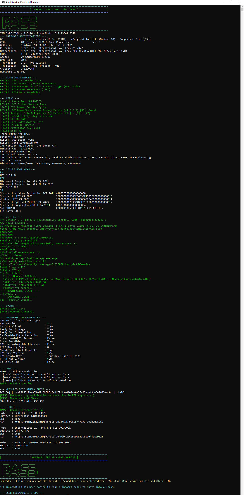
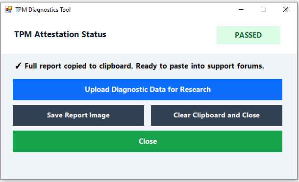

# TPM-INFO-TOOL

An experimental tool that displays technical information to help troubleshoot TPM-related settings for gaming.

## 📦 How to Use

1) Download and run 'TPM INFO TOOL.cmd'.
    - 1a) Direct Donwload Link: https://github.com/ArrowGamingCode/TPM-INFO-TOOL/archive/refs/heads/main.zip
    - 1b) Extract zip file.
    - 1c) Run "TPM INFO TOOL.cmd". You will see an admin prompt (UAC).

2) The program will display a list of TPM related info and will automatically copy it to your clipboard.
3) Look for the overall TPM Attestation PASS/FAIL.

## 📷 Preview

## Features
* **PC Specification Gathering:** Collects details on OS, BIOS, Motherboard etc.
* **Minimum Requirements Check:** Verifies Secure Boot, Disk Partition style, CPU compatibility, and related hardware settings.
* **Game-Specific Checks:** Includes tests for (COD) broker, User Account Control (UAC), and other gaming prerequisites.
* **UEFI 2023 Boot Verification**
* **Advanced TPM Analysis:** Inspects PCR Banks, DBX Revocation status, and security states.
* **Attestation Testing:** Supports both Remote and Local Attestation tests.
* **Remediation Steps:** Provides recommended user actions and clear instructions to fix non-compliant settings.
* **Export Options:** Easily save diagnostic results as an image or copy directly to your clipboard.
* **And heaps more!**
  
## Information
* Some PCs require a BIOS update, and no tool can change this.
* For the best results, run the latest BIOS before running the tool.

## 📷 Preview 2

